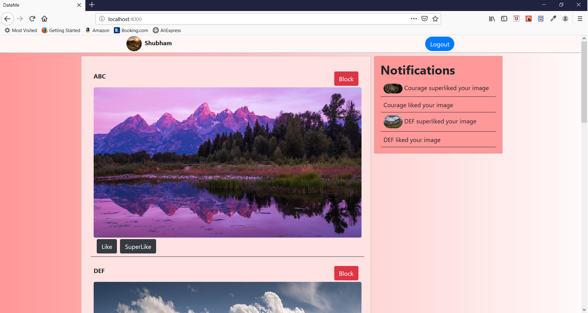

# DateMe
DateMe is a dating app which contains the following features

* Sign up/login with email password ( Jwt based login with email and password )
* One Image uploading for each user
* Logged in user can scroll images and perform 3 actions
(Like,block,superlike other image/user)
* Image like api : Whenever some one like other user image, a socket io notification will be sent to other user but image of person who liked would not be visible to who is being liked
* Image superlike : Whenever some one super like other user image, a socket io notification will be sent to other user and image of person who liked will be visible to who is being liked.
* Block User api: When a user block another user then his/her image would not be shown while blocked user is
scrolling random images



### Demo
Demo of the project is present at https://drive.google.com/open?id=13IKR4B4zCoVLueVKlrKK2aDD3Dok35RD

---

## Backend 
Its backend is made on NodeJS . MongoDB is used for database . To run the backend server you need to have node and mongodb installed on your system and open Backend folder and perform the following steps.

```powershell
# Install dependencies
npm install -g nodemon
npm install

# Start mongodb server
## First create data folder in Backend  
mongod --dbpath=./data

# Start server on localhost:5000
npm start
```

---

## Frontend
Frontend is made on ReactJS and Bootstrap is used for styling. To start app open Frontend folder and perform the following steps.

```powershell
# Install dependencies
npm install

# Serve on localhost:3000
npm start
```


## Project Structure
    .
    ├── Backend                     # backend
    │   ├── controllers              
    |   ├── db                      # database files
    |   ├── routes  
    |   |   ├── api                 # rest api              
    |   |   |   ├── home                
    |   |   |   |   └── ...    
    │   |   |   ├── index.js       
    │   |   |   ├── login.js       
    │   |   |   └── signup.js       
    |   |   └── auth.js             # verify jwt middleware
    |   ├── utils                   
    |   |   └── jwt.js              # create and verify jwt
    │   └── server.js               # entry point
    ├── Frontend                          
    |   ├── app                                    
    |   |   ├── actions  
    |   |   ├── components                
    |   |   ├── containers          # contains business logic
    |   |   ├── controllers         
    |   |   ├── store               # redux store
    |   |   ├── styles
    |   |   ├── index.html
    |   |   ├── index.jsx           # entry point
    |   |   ├── public              
    |   |   └── ...
    └── ...


# App Info
### Author 
Shubham Singal

---

### Version 
1.0.0

